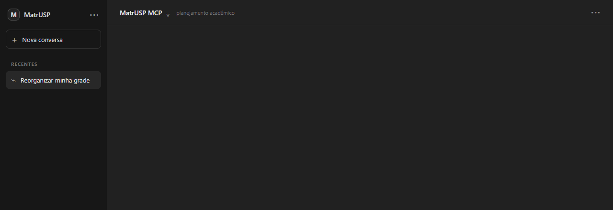
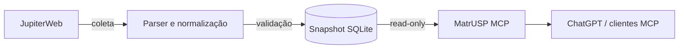

<div align="center">
  <h1>MatrUSP MCP</h1>
  <p><strong>Planejamento acadêmico da USP para ChatGPT e outros clientes MCP.</strong></p>
  <p>Disciplinas, currículos, horários, conflitos e geração de grades a partir dos dados públicos do JupiterWeb.</p>

  <p>
    <a href="https://github.com/koobzaar/matrusp-mcp/actions/workflows/ci.yml"></a>
    <a href="https://github.com/koobzaar/matrusp-mcp/actions/workflows/contract.yml"></a>
    
    
    <a href="LICENSE"></a>
  </p>
</div>

<p align="center">
  
</p>

## Planejamento acadêmico, mas consultável por IA

Montar uma grade na USP exige cruzar informações que normalmente ficam espalhadas entre disciplinas, turmas, horários, créditos, requisitos e currículos.

O **MatrUSP MCP** transforma os dados públicos do JupiterWeb em uma interface estruturada para assistentes de IA. Em vez de interpretar páginas e tabelas manualmente, o modelo pode consultar os dados relevantes e usar operações próprias para verificar conflitos, encontrar alternativas e montar grades.

### Principais recursos

* busca de disciplinas, ofertas, professores, unidades e campi;
* consulta de créditos, requisitos e estrutura curricular;
* consideração de todas as turmas disponíveis de uma disciplina;
* verificação de conflitos entre aulas e compromissos;
* busca de disciplinas para preencher janelas livres;
* geração e comparação de alternativas de grade;
* ranking por critérios como dias no campus e janelas entre aulas;
* representação explícita de horários incompletos como `unknown`.

O repositório também inclui a skill [`matrusp-academic-planning`](skills/matrusp-academic-planning/SKILL.md), com semântica e orientação para consultas acadêmicas mais complexas.

## Tools MCP

| Tool                       | Função                                                      |
| -------------------------- | ----------------------------------------------------------- |
| `search_offerings`         | Busca ofertas com filtros acadêmicos e temporais            |
| `get_discipline`           | Consulta detalhes e turmas de uma disciplina                |
| `find_gap_fillers`         | Encontra ofertas para uma janela livre                      |
| `check_schedule_conflicts` | Verifica conflitos entre turmas e bloqueios                 |
| `generate_schedules`       | Gera e ordena combinações de grade                          |
| `compare_schedules`        | Compara alternativas de horário                             |
| `search_curricula`         | Busca currículos por texto, unidade ou campus               |
| `get_curriculum`           | Consulta disciplinas, créditos e requisitos de um currículo |

Todas as tools são read-only e idempotentes. As respostas incluem `snapshot_id`, `observed_at`, `warnings` e `data`.

## Rodando localmente

Requisitos: **Python 3.12+** e **uv 0.10.11–0.12.x**.

```bash
git clone https://github.com/koobzaar/matrusp-mcp.git
cd matrusp-mcp

uv sync --locked
uv run --locked matrusp-mcp serve --transport stdio --snapshot data/matrusp.sqlite
```

Para Streamable HTTP:

```bash
uv run --locked matrusp-mcp serve \
  --transport streamable-http \
  --snapshot data/matrusp.sqlite
```

Configuração de clientes MCP, Docker e variáveis de ambiente estão em [Instalação e execução](docs/getting-started.md).

## Como os dados chegam ao MCP



A coleta é separada do servidor.

O crawler transforma os dados públicos do JupiterWeb em snapshots SQLite versionados e validados. Durante uma consulta, o servidor trabalha somente sobre o snapshot: não acessa o JupiterWeb em tempo real e não modifica os dados.

A lógica de horários também não fica inteiramente a cargo do modelo. Conflitos, combinações e métricas de grade são calculados deterministicamente pelo servidor.

## Referência técnica

| Área                               | Documentação                                                           |
| ---------------------------------- | ---------------------------------------------------------------------- |
| Instalação, stdio, HTTP e Docker   | [Instalação e execução](docs/getting-started.md)                       |
| Instalação no ChatGPT              | [Tutorial para usar no ChatGPT](docs/chatgpt.md)                       |
| Skill de planejamento              | [matrusp-academic-planning](skills/matrusp-academic-planning/SKILL.md) |
| Tools, inputs, respostas e erros   | [Referência MCP](docs/mcp-reference.md)                                |
| Estrutura interna e domínio        | [Arquitetura](docs/architecture.md)                                    |
| Conflitos, bundles e ranking       | [Semântica temporal e ranking](docs/temporal-and-ranking.md)           |
| Coleta e snapshots                 | [Snapshots e crawler](docs/snapshots-and-crawler.md)                   |
| Desenvolvimento, testes e releases | [Desenvolvimento e releases](docs/development-and-releases.md)         |
| Segurança HTTP                     | [Segurança HTTP](docs/http-security.md)                                |

## Limitações

> [!IMPORTANT]
> O MatrUSP MCP não é um sistema oficial da USP.

Horários, vagas e currículos refletem o instante do snapshot. Vagas observadas não garantem matrícula, e o servidor não conhece automaticamente informações pessoais do aluno, como disciplinas já cursadas ou requisitos cumpridos.

Para decisões acadêmicas oficiais, consulte o [JupiterWeb](https://uspdigital.usp.br/jupiterweb/).

## Licença

Código distribuído sob [AGPL-3.0-only](LICENSE).

Consulte também [CONTRIBUTORS.md](CONTRIBUTORS.md).
