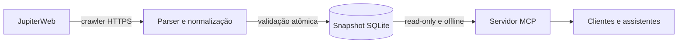

<div align="center">
  <h1>MatrUSP MCP</h1>
  <p>Planejamento acadêmico da USP com dados públicos versionados, consultas MCP e geração determinística de grades.</p>

  <p>
    <a href="#sobre-o-projeto">Projeto</a> •
    <a href="#principais-recursos">Recursos</a> •
    <a href="#começando">Começando</a> •
    <a href="#documentação">Documentação</a>
  </p>

  <p>
    <a href="https://github.com/koobzaar/matrusp-mcp/actions/workflows/ci.yml"></a>
    <a href="https://github.com/koobzaar/matrusp-mcp/actions/workflows/contract.yml"></a>
    
    
    <a href="LICENSE"></a>
  </p>
</div>

## Sobre o projeto

O **MatrUSP MCP** transforma as informações públicas do JupiterWeb em uma interface estruturada para
clientes compatíveis com o [Model Context Protocol](https://modelcontextprotocol.io/). O servidor
permite consultar disciplinas, turmas, horários, professores e currículos, verificar conflitos e
montar alternativas de grade com ordenação reproduzível.

Os dados são coletados por um processo separado, normalizados e publicados como snapshots SQLite
validados. Durante o uso, o servidor é **somente-leitura e offline**: não acessa o JupiterWeb, não
modifica o banco e sempre identifica a observação usada na resposta.

### Objetivos

- oferecer uma interface estável e tipada sobre páginas públicas heterogêneas;
- apoiar busca de ofertas, análise curricular e planejamento de horários;
- representar conflitos e dados incompletos sem produzir falsas certezas;
- gerar grades top-K com restrições, preferências e desempate determinístico;
- preservar proveniência, qualidade e instante de observação de cada snapshot.

## Principais recursos

| Recurso | Descrição |
|---|---|
| Busca acadêmica | Disciplinas, ofertas, professores, unidades, campi e currículos |
| Horários | Filtros por dia e janela, intervalos semiabertos e bloqueios manuais |
| Conflitos | Estados `conflict`, `no_conflict` e `unknown` |
| Geração de grades | Backtracking top-K, hard constraints, preferências e orçamento de busca |
| Currículos | Período ideal, créditos, requisitos fortes/fracos e indicações de conjunto |
| Qualidade dos dados | Horários completos, parciais ou desconhecidos e avisos públicos |
| Snapshots | SQLite imutável, FTS5, manifesto, checksums e publicação atômica |
| Transportes | MCP por stdio ou Streamable HTTP stateless |

## Como funciona



O crawler reconhece ofertas, ausências de oferecimento, estruturas curriculares e detalhes de
disciplinas. O snapshot só é promovido após verificações de integridade, foreign keys, schema,
contagens e índices de busca. O runtime então fornece a mesma camada de serviço pelos dois
transportes suportados.

## Começando

Requisitos: **Python 3.12+** e **uv 0.12.5**.

```bash
git clone https://github.com/koobzaar/matrusp-mcp.git
cd matrusp-mcp
uv sync --locked
uv run --locked matrusp-mcp validate data/matrusp.sqlite
uv run --locked matrusp-mcp serve --transport stdio --snapshot data/matrusp.sqlite
```

Para Streamable HTTP:

```bash
uv run --locked matrusp-mcp serve \
  --transport streamable-http \
  --snapshot data/matrusp.sqlite
```

Configuração de clientes MCP, variáveis de ambiente e Docker estão em
[Instalação e execução](docs/getting-started.md).

## Ferramentas MCP

| Tool | Função |
|---|---|
| `search_offerings` | busca ofertas correntes com filtros acadêmicos e temporais |
| `get_discipline` | retorna detalhes e versões de uma disciplina |
| `find_gap_fillers` | encontra ofertas compatíveis com uma janela livre |
| `check_schedule_conflicts` | verifica bundles, turmas e bloqueios manuais |
| `generate_schedules` | gera e ordena combinações de grade |
| `compare_schedules` | compara alternativas com as mesmas métricas do gerador |
| `search_curricula` | busca currículos atuais por texto, unidade ou campus |
| `get_curriculum` | retorna itens, períodos e relações de um currículo |

Todas as tools são read-only, idempotentes e retornam um envelope com `snapshot_id`, `observed_at`,
`warnings` e `data`. O recurso `matrusp://snapshot/manifest` expõe a proveniência do snapshot.

## Documentação

| Área | Referência |
|---|---|
| Instalação, stdio, Streamable HTTP, Docker | [Instalação e execução](docs/getting-started.md) |
| Camadas, módulos, domínio, IDs, invariantes | [Arquitetura](docs/architecture.md) |
| Tools, inputs, respostas, erros, manifesto | [Referência MCP](docs/mcp-reference.md) |
| Intervalos, conflitos, bundles, top-K, score | [Semântica temporal e ranking](docs/temporal-and-ranking.md) |
| JupiterWeb, parsers, SQLite v1, artefatos | [Snapshots e crawler](docs/snapshots-and-crawler.md) |
| ASGI, Host, Origin, body limit, rate limit | [Segurança HTTP](docs/http-security.md) |
| uv, testes, CI, live contract, releases, GHCR | [Desenvolvimento e releases](docs/development-and-releases.md) |

## Tecnologias

| Camada | Tecnologias |
|---|---|
| Protocolo e runtime | Python 3.12, MCP v2, Pydantic v2, Starlette, Uvicorn |
| Dados e coleta | SQLite FTS5, Beautiful Soup, html5lib, httpx |
| Engenharia e entrega | uv, pytest, Hypothesis, Playwright, Ruff, Pyright, Docker |

## Dados e limitações

> [!IMPORTANT]
> O MatrUSP MCP não é um sistema oficial da USP. Horários, vagas e currículos refletem o instante do
> snapshot; vagas são observações, não garantias de matrícula. Consulte o
> [JupiterWeb](https://uspdigital.usp.br/jupiterweb/) para decisões acadêmicas oficiais.

O snapshot em `data/matrusp.sqlite` é destinado a desenvolvimento. Snapshots de produção são
gerados pelo workflow de coleta e publicados separadamente com manifesto e checksums.

## Licença

Código distribuído sob [AGPL-3.0-only](LICENSE). Consulte também
[CONTRIBUTORS.md](CONTRIBUTORS.md) para atribuição e histórico da comunidade MatrUSP.
