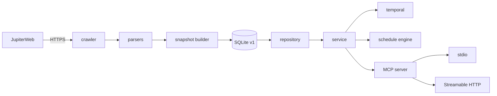

# Arquitetura

## Visão geral

O MatrUSP MCP separa coleta, persistência, domínio e transporte. A coleta é o único componente que
acessa a rede; o serviço MCP opera exclusivamente sobre um snapshot SQLite imutável.

## Camadas e módulos

| Módulo | Responsabilidade |
|---|---|
| `crawler/crawler.py` | navegação JupiterWeb, retries, concorrência, cache e classificação de páginas |
| `crawler/parsers.py` | conversão de HTML em estruturas normalizadas de domínio |
| `snapshot.py` | schema, construção, validação, publicação atômica e artefatos |
| `repository.py` | consultas SQLite somente-leitura, FTS5 e paginação |
| `domain.py` | entidades, estados e invariantes independentes de transporte |
| `bundles.py` | agrupamento de componentes teóricos e práticos selecionáveis |
| `temporal.py` | intervalos, datas e conflitos trivalentes |
| `engine.py` | busca top-K determinística com restrições e preferências |
| `service.py` | casos de uso, normalização, cursores, avisos e erros públicos |
| `api_models.py` | contratos Pydantic estritos das oito ferramentas |
| `mcp_server.py` | ferramentas, recurso de manifesto e enquadramento MCP |
| `http_server.py` | ASGI, Host/Origin, corpo, limites e observabilidade |
| `cli.py` | comandos `serve`, `crawl` e `validate` |

O domínio não depende de HTML, SQLite ou transporte. Os adaptadores transformam dados em ambas as
direções, mantendo a mesma semântica para stdio e HTTP.

## Fluxo de leitura

1. O processo recebe o caminho do snapshot por argumento ou por `MATRUSP_SNAPSHOT`.
2. `SnapshotRepository` abre a URI SQLite com `mode=ro&immutable=1`.
3. `Service` normaliza entradas e coordena repositório, semântica temporal e gerador.
4. `mcp_server` converte validações e erros em respostas MCP estruturadas.
5. Toda resposta inclui identidade e horário de observação do snapshot usado.

O runtime não atualiza dados, não cria tabelas e não faz fallback para o JupiterWeb. Trocar dados
requer publicar outro arquivo SQLite validado e reiniciar o processo.

## Conceitos de domínio

### Disciplina e versão

Uma disciplina é identificada pelo código USP e pode conter título, unidade, departamento,
créditos, objetivos e conteúdo. As páginas versionadas são armazenadas separadamente; disciplinas
que aparecem em currículos mas não têm oferta corrente podem existir como `stub`.

### Turma e encontro

Uma turma representa uma seção ofertada. Seus encontros carregam dia, horário, intervalo de datas,
professores e texto original da fonte. Qualidade temporal incompleta é preservada em vez de
inferida.

### Bundle

Um bundle é a unidade selecionável pelo planejador. Uma turma independente produz um bundle; uma
disciplina com componentes teórico e prático produz combinações válidas entre os componentes.
Práticas órfãs permanecem auditáveis, mas não são selecionáveis.

### Currículo

Um currículo combina curso e habilitação, com campus, unidade e itens por natureza e período ideal.
Cada item pode conter requisitos fortes, requisitos fracos e indicações de conjunto.

### Snapshot

Um snapshot é uma observação versionada do conjunto de ofertas e currículos. O manifesto registra
schema, licença, origem, commit do crawler, checksums e contagens. Esse identificador também vincula
cursores e respostas públicas à mesma visão dos dados.

## Identificadores estáveis

| Entidade | Formato |
|---|---|
| Turma | `section:{discipline_code}:{section_code}` |
| Bundle simples | `bundle:{discipline_code}:{section_code}` |
| Bundle teoria/prática | `bundle:{discipline_code}:{theory_section}+{practice_section}` |
| Currículo | `curriculum:{course_code}:{habilitation_code}` |

IDs são gerados deterministicamente a partir dos identificadores da fonte. Duplicatas de turma são
consideradas erro de origem; o crawler não escolhe silenciosamente uma delas.

## Invariantes

- runtime somente-leitura e offline;
- contratos públicos Pydantic com `extra="forbid"`;
- horários modelados como intervalos semiabertos;
- incerteza temporal explícita, nunca convertida em compatibilidade;
- paginação vinculada ao snapshot;
- ordenação e desempate determinísticos;
- snapshots promovidos apenas depois da validação completa;
- nenhuma credencial ou configuração de produção incorporada ao banco.

## Referências relacionadas

- [Referência MCP](mcp-reference.md)
- [Semântica temporal e geração de horários](temporal-and-ranking.md)
- [Snapshots e crawler](snapshots-and-crawler.md)
- [Segurança e transporte HTTP](http-security.md)
