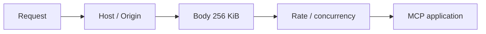

# Segurança e transporte HTTP

## Superfície ASGI

O transporte Streamable HTTP é stateless e responde em JSON. A aplicação expõe apenas:

| Método e rota | Função |
|---|---|
| `POST /mcp` | chamadas MCP |
| `GET /mcp` | comportamento definido pelo transporte MCP |
| `GET /healthz` | liveness e `snapshot_id` |
| `GET /readyz` | validação do snapshot, contagens e erros |

`/readyz` responde `200` quando o snapshot é válido e `503` quando a validação falha.

## Ordem de middleware



A ordem é uma propriedade de segurança:

1. `HostOriginMiddleware` rejeita o destino antes de consumir o corpo;
2. `BodyLimitMiddleware` limita corpo declarado ou em chunks;
3. `RateLimitMiddleware` identifica a ferramenta e aplica custo e concorrência;
4. a aplicação MCP recebe somente requisições que cruzaram os limites anteriores.

## Host e Origin

Hosts permitidos por padrão:

```text
localhost
localhost:*
127.0.0.1
127.0.0.1:*
testserver
testserver:*
```

`MATRUSP_ALLOWED_HOSTS` substitui a lista padrão por valores CSV. O sufixo `:*` aceita qualquer
porta para o nome exato anterior. Host não confiável retorna `421` sem ler o corpo.

Se o cabeçalho `Origin` estiver presente, ele precisa corresponder a
`MATRUSP_ALLOWED_ORIGINS`. Com a lista vazia, qualquer Origin de navegador é rejeitado com `403`.
Clientes não navegadores que omitem Origin continuam sujeitos ao controle de Host.

```bash
MATRUSP_ALLOWED_HOSTS=mcp.exemplo.br \
MATRUSP_ALLOWED_ORIGINS=https://app.exemplo.br \
uv run --locked matrusp-mcp serve \
  --transport streamable-http \
  --host 127.0.0.1
```

## Limite de corpo

O limite máximo é `256 KiB` (`262144` bytes).

| Caso | Resposta |
|---|---|
| `Content-Length` não inteiro ou negativo | `400` |
| `Content-Length` acima do limite | `413` sem consumir o corpo |
| corpo chunked cruza o limite | `413` imediatamente após o chunk excedente |
| corpo dentro do limite | conteúdo recomposto e repassado uma vez |

O SDK MCP recebe o mesmo limite como defesa adicional.

## Rate limit

O rate limit usa token bucket em memória por IP efetivo:

| Parâmetro | Valor |
|---|---:|
| capacidade | `20` tokens |
| reposição | `1` token/s |
| `generate_schedules` | `5` tokens |
| `find_gap_fillers` | `2` tokens |
| `check_schedule_conflicts` | `2` tokens |
| `compare_schedules` | `2` tokens |
| demais chamadas | `1` token |

Quando não há tokens, `POST /mcp` retorna `429`. Health e readiness não consomem tokens. Como o
estado é local ao processo, múltiplas réplicas não compartilham buckets.

## Concorrência

- máximo global: `16` requisições MCP simultâneas;
- máximo de `generate_schedules`: `4` simultâneas;
- requisições aguardam sem ultrapassar esses semáforos;
- validação de Host e tamanho ocorre antes da espera de concorrência.

## Proxy confiável

O IP direto da conexão é a chave padrão. `X-Forwarded-For` só é usado quando o IP direto pertence a
um CIDR configurado em `MATRUSP_TRUSTED_PROXY_CIDRS`. Apenas o primeiro endereço da lista é
considerado.

```bash
MATRUSP_TRUSTED_PROXY_CIDRS=127.0.0.1/32,10.0.0.0/8 \
uv run --locked matrusp-mcp serve --transport streamable-http
```

Não inclua redes amplas que possam ser acessadas diretamente por clientes não confiáveis.

## Logs

Cada `POST /mcp` limitado produz um evento JSON com:

- `request_id` aleatório;
- nome da ferramenta, quando identificável;
- duração em milissegundos;
- status HTTP;
- `snapshot_id`;
- contadores agregados de requests aceitos e rejeitados.

O middleware não registra corpo MCP, argumentos de ferramenta ou IP do cliente. Uvicorn é iniciado
com access log desativado pela CLI.

## Limites da proteção embutida

O servidor não oferece autenticação, autorização por usuário, TLS, rate limit distribuído ou
persistência de auditoria. Uma exposição pública deve usar proxy ou gateway para esses controles,
mantendo `MATRUSP_ALLOWED_HOSTS`, `MATRUSP_ALLOWED_ORIGINS` e CIDRs restritos.

## Checklist de implantação

- terminar TLS no proxy;
- exigir autenticação antes de `/mcp`;
- encaminhar somente `/mcp`, `/healthz` e `/readyz`;
- definir Host e Origin explicitamente;
- confiar em `X-Forwarded-For` somente a partir do proxy;
- montar o snapshot como somente-leitura;
- executar como usuário sem privilégios;
- dimensionar réplicas considerando buckets locais;
- monitorar `429`, `503`, duração e `snapshot_id`.
