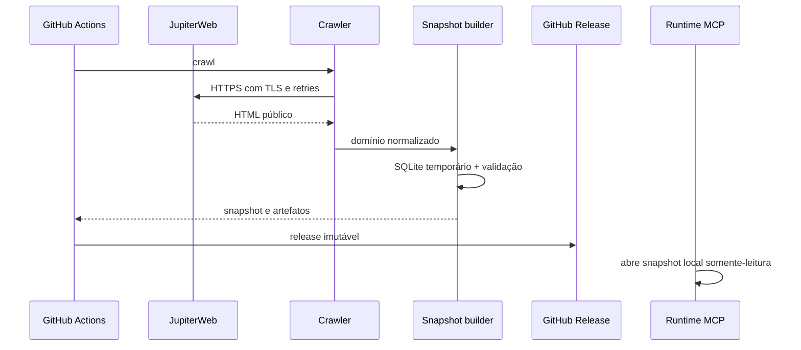

# Snapshots e crawler JupiterWeb

## Modelo operacional

O crawler e o runtime têm ciclos separados:



Somente o crawler acessa o JupiterWeb. O runtime MCP não atualiza dados e não faz consultas de rede.

## Comando de coleta

```bash
uv run --locked matrusp-mcp crawl \
  --output /tmp/matrusp.sqlite \
  --previous /caminho/snapshot-anterior.sqlite \
  --concurrency 8 \
  --artifacts /tmp/release
```

| Opção | Regra |
|---|---|
| `--output` | destino obrigatório do novo SQLite |
| `--previous` | reutiliza versões e mescla histórico do snapshot anterior |
| `--concurrency` | `1..16`, padrão `8` |
| `--accept-large-delta` | autoriza variação superior a 20% em disciplinas, turmas, currículos ou itens curriculares |
| `--artifacts` | publica gzip, manifesto e checksums após validação |

Sem `--previous`, o banco é construído diretamente por publicação atômica. Com um snapshot
anterior, o candidato é validado e submetido à proteção de delta antes de substituir o destino.

## Política de rede

| Parâmetro | Valor |
|---|---:|
| timeout total por URL | até `60 s` |
| tentativas | exatamente `4` |
| concorrência | padrão `8`, máximo `16` |
| backoff | exponencial a partir de `250 ms` |
| jitter | determinístico por URL e tentativa |
| TLS | verificação obrigatória |
| User-Agent | `MatrUSP-MCP/0.1` com URL do projeto |

Cada corpo HTTP aceito recebe SHA-256 e entra em `source_checksums`. Status diferente de `200`,
timeout ou erro de transporte esgota a política de retry e aborta a coleta.

## Descoberta e classificação

O índice de disciplinas é uma lista de candidatos, não uma confirmação de oferta. Para cada
candidato, a página de turmas termina em um destes estados:

| Estado | Efeito |
|---|---|
| `confirmed` | oferta corrente analisada |
| `no_current_offer` | ausência de oferecimento reconhecida explicitamente |
| `invalid_source` | DOM ambíguo ou inválido; aborta a coleta |
| `fetch_error` | falha de rede; aborta a coleta |
| `parse_error` | conteúdo inesperado; aborta a coleta |

Mensagens de ausência reconhecem texto acentuado, não acentuado e mojibake corrente, incluindo
`N?o existe oferecimento`. Um erro desconhecido nunca é convertido em ausência de oferta.

## Parsing de ofertas

O parser usa HTML minimizado da forma real do JupiterWeb e aplica estas regras:

- considera apenas linhas cujo ancestral de tabela mais próximo é a tabela analisada;
- associa cada tabela de identificação de turma somente às tabelas seguintes de horário e vagas;
- rejeita IDs de turma duplicados como `invalid_source`;
- separa cabeçalhos de horário dos dados e nunca interpreta `Prof(a) .` como professor;
- preserva `original_day`, mantém linhas de continuação e deduplica professores deterministicamente;
- lê vagas agregadas e por grupo, com `group_name` e colunas opcionais ausentes;
- preserva textos de vaga como observações da fonte, sem prometer disponibilidade atual.

Depois do parsing, `derive_bundles` combina componentes teóricos e práticos e marca vínculos órfãos
como não selecionáveis.

## Parsing de currículos e disciplinas

São coletados somente currículos atuais com `tipo=N`; grades históricas `tipo=V` não entram no
snapshot corrente.

O índice atual tem duas formas legítimas: alguns links já contêm o nome do curso; outros exibem
somente `curso habilitação` e deixam o nome e o período em células adjacentes. Esses metadados são
preservados antes da consulta da grade. Links duplicados mantêm a primeira descrição observada.

O parser curricular mantém estado de natureza e período ideal, aceita códigos numéricos ou
alfanuméricos apenas em linhas com forma de disciplina e ignora títulos como `ATPA`. Relações são
interpretadas assim:

| Texto da fonte | Relação |
|---|---|
| `Requisito` | requisito forte |
| `Requisito fraco` | requisito fraco |
| `Indicação de Conjunto` | indicação de conjunto |
| `ou` | separador, sem disciplina emitida |

Linhas seguintes de pré-requisito são anexadas à disciplina anterior, e relações duplicadas são
eliminadas. O índice também fornece metadados de campus.

Uma página de grade sem itens só é aceita quando a própria resposta contém simultaneamente o
cabeçalho de grade, a tabela de carga horária e total explicitamente zero. O currículo continua
presente no snapshot com `items=[]` e entra em `state_counts` como `no_current_curriculum`. HTML
vazio, páginas de erro ou qualquer forma não reconhecida permanecem `parse_error` e abortam a
coleta. A descoberta global de zero currículos atuais também aborta, em vez de publicar um domínio
silenciosamente vazio.

Detalhes de disciplina são lidos por cabeçalho e conteúdo seguinte. `Ementa` tem prioridade como
resumo, com fallback para `Conteúdo Programático`; título, departamento, créditos e `Objetivos`
são incluídos quando presentes. Ausência de cabeçalhos opcionais não invalida a disciplina.

Versões já observadas são reutilizadas por `(discipline_code, verdis)`. Disciplinas vistas apenas
em currículos ou no histórico anterior permanecem como `stub`, sem simular uma oferta atual.

## Normalização de campus

Nomes de campus são normalizados a partir dos índices curriculares e metadados de unidade. Valores
não reconhecidos não são agrupados genericamente como “Outro”. Correções excepcionais são
versionadas como overrides explícitos no código, com proveniência separada.

## Schema SQLite v1

| Grupo | Tabelas |
|---|---|
| Metadados | `snapshot_metadata` |
| Organização | `units` |
| Disciplinas | `disciplines`, `discipline_units`, `discipline_versions` |
| Ofertas | `sections`, `meetings`, `professors`, `vacancies`, `section_links` |
| Seleção | `bundles`, `bundle_sections` |
| Currículos | `curricula`, `curriculum_items`, `prerequisites` |
| Histórico | `offering_history` |
| Busca | `discipline_fts`, `professor_fts` com SQLite FTS5 |

Chaves estrangeiras protegem referências internas. Encontros armazenam minutos normalizados,
datas, texto de horário e dia original. Vagas incluem categoria, grupo, valores textuais e instante
de observação.

## Construção e validação

`build_snapshot` cria um arquivo temporário irmão do destino, habilita foreign keys, insere todos os
dados, valida o banco e usa `os.replace` apenas após sucesso. Uma falha remove o temporário e
preserva o snapshot anterior.

```bash
uv run --locked matrusp-mcp validate data/matrusp.sqlite
```

A validação verifica:

- `PRAGMA integrity_check`;
- `PRAGMA foreign_key_check`;
- presença das tabelas obrigatórias;
- versão de schema e contagens contra o manifesto;
- contagens de todas as tabelas de conteúdo produzidas pelo builder, inclusive itens curriculares;
- correspondência entre currículos vazios e o estado explícito `no_current_curriculum`;
- estados `complete`, `partial` e `unknown`;
- inexistência de bundle incompleto marcado selecionável;
- tabelas virtuais e colunas FTS5 esperadas.

O comando escreve JSON com `ok`, `counts` e `errors`, usando exit code diferente de zero em caso de
falha.

## Manifesto e artefatos

O manifesto contém:

- `snapshot_id` e `schema_version`;
- `observed_at` e commit do crawler;
- licença e URL do código-fonte;
- URLs de origem e SHA-256 dos corpos coletados;
- contagens de classificação e de entidades;
- nome do servidor e transportes MCP.

`--artifacts` cria, somente após validação:

```text
matrusp-snapshot-{snapshot_id}.sqlite.gz
manifest-{snapshot_id}.json
SHA256SUMS
```

O gzip usa `mtime=0` para ser reprodutível. Cada arquivo é escrito em um temporário e promovido
atomicamente. `SHA256SUMS` cobre o snapshot comprimido e o manifesto.

## Snapshot de desenvolvimento

`data/matrusp.sqlite` é pequeno e serve a testes locais, validação e build da imagem. O workflow de
release substitui esse arquivo somente depois do crawl e da validação, faz push do commit de snapshot
para `main` e, assim, permite que a integração Git da Vercel faça o próximo deployment com a mesma
observação validada. Mudanças de código não devem regenerar esse arquivo.

Veja [Desenvolvimento e releases](development-and-releases.md) para os gates de publicação.
