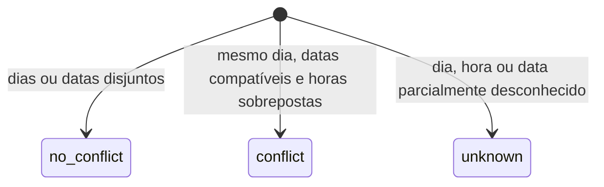

# Semântica temporal e geração de horários

## Intervalos de horário

Horários são convertidos em minutos desde meia-noite e representados como intervalos semiabertos
`[início, fim)`. Dois encontros adjacentes não conflitam:

```text
[08:00, 10:00) e [10:00, 12:00) -> no_conflict
[08:00, 10:01) e [10:00, 12:00) -> conflict
```

Um intervalo com fim igual ou anterior ao início é inválido. O texto original de início, fim e dia
é preservado no encontro para auditoria.

## Intervalos de data

Datas são inclusivas. Dois encontros no mesmo dia da semana só são temporalmente concorrentes se
seus períodos acadêmicos puderem se sobrepor.

- ambos os encontros sem datas: presume-se que as datas podem coincidir;
- os quatro limites presentes: usa-se interseção inclusiva;
- somente parte dos limites presente: o resultado é `unknown`;
- períodos completos e disjuntos: `no_conflict`.

## Estado trivalente



| Estado | Interpretação |
|---|---|
| `conflict` | existe ao menos uma sobreposição comprovada |
| `no_conflict` | todas as comparações são comprovadamente compatíveis |
| `unknown` | não há conflito comprovado, mas faltam dados para garantir compatibilidade |

Um estado desconhecido nunca é convertido em seguro. O verificador o expõe; o gerador descarta a
combinação e contabiliza a razão em `discard_reasons.unknown`.

## Filtros por janela

`overlaps` exige interseção positiva entre encontro e janela. Quando `days` também é fornecido, o
mesmo encontro precisa satisfazer dia e horário; um encontro de segunda no dia solicitado e outro
de terça no horário solicitado não formam um resultado válido em conjunto.

`contained` exige contenção integral conforme a operação:

- em busca de ofertas, preserva a semântica de filtragem do repositório;
- em `find_gap_fillers`, todos os encontros do bundle precisam ocorrer no dia e dentro da janela.

Ofertas com agenda `partial` ou `unknown` ficam fora de operações temporais por padrão.

## Formação de bundles

O planejador escolhe bundles, não linhas isoladas do JupiterWeb.

| Forma da oferta | Bundle |
|---|---|
| turma independente | uma turma |
| teoria sem prática vinculada | turma teórica isolada |
| teoria com práticas vinculadas | uma combinação para cada par teoria/prática válido |
| prática sem teoria resolvida | bundle não selecionável com `orphan_practice_link` |

Somente bundles `selectable` com `schedule_status == "complete"` entram no gerador.

## Busca de combinações

O gerador usa backtracking determinístico:

1. normaliza códigos e limita cada disciplina aos primeiros `100` candidatos ordenados por ID;
2. ordena disciplinas pela menor quantidade de candidatos e depois pelo código;
3. pré-calcula o grafo de conflitos entre candidatos;
4. inicia com bundles existentes e bloqueios manuais;
5. descarta conflito, incerteza, baixa qualidade e violação de restrição;
6. avalia combinações completas e mantém somente as melhores `max_results`.

Limites públicos:

| Limite | Valor |
|---|---:|
| disciplinas obrigatórias | `1..15` |
| candidatos usados por disciplina | até `100` |
| resultados | `1..50` |
| nós explorados | `1..1.000.000` |

O acumulador de resultados é ordenado e limitado a `max_results`. Ao inserir o resultado
`max_results + 1`, o pior item atual é descartado imediatamente; portanto, a memória de ranking não
cresce com o número total de combinações encontradas.

`truncated: true` indica que o orçamento de nós foi esgotado. `explored_nodes` inclui nós internos e
folhas visitados, preservando uma medida determinística de trabalho.

## Score

Quanto menor o score, melhor a alternativa:

```text
score =
    days_weight * active_days
  + gaps_weight * total_gap_hours
  + outside_preferred_windows_weight * hours_outside_preferred_windows
  + avoided_professors_weight * avoided_professor_matches
  - preferred_professors_weight * preferred_professor_matches
```

Métricas:

| Métrica | Cálculo |
|---|---|
| `active_days` | quantidade de dias distintos após união dos encontros |
| `total_gap_hours` | soma de lacunas entre encontros do mesmo dia |
| `hours_outside_preferred_windows` | duração de encontros não contidos em uma janela preferida do mesmo dia |
| `avoided_professor_matches` | professores distintos encontrados na lista evitada |
| `preferred_professor_matches` | professores distintos encontrados na lista preferida |

Nomes de professores são comparados com normalização de caixa, espaços e acentos. Encontros
adjacentes ou sobrepostos são unidos antes do cálculo de dias e lacunas.

## Ordenação e desempate

Resultados são ordenados pela chave `(score, bundle_ids)`. `bundle_ids` é uma tupla determinística,
portanto empates de score têm a mesma ordem em execuções equivalentes. `compare_schedules` usa
exatamente as mesmas métricas e fórmula.

## Restrições rígidas

- `forbidden_days` remove candidatos antes da busca;
- `required_days` exige o conjunto informado na alternativa final;
- `max_active_days` limita `active_days`;
- `max_total_gap_hours` limita `total_gap_hours`;
- bundles existentes e bloqueios manuais participam dos conflitos desde o início.

Falhas finais entram em `discard_reasons.hard_constraint`. Disciplinas sem candidatos completos
entram em `discard_reasons.quality`; não é fabricada uma alternativa parcial.

## Garantias de determinismo

- normalização e ordenação explícitas de candidatos;
- grafo de conflitos independente da ordem de descoberta;
- orçamento contado por nó visitado;
- acumulador top-K limitado e ordenado;
- desempate por IDs estáveis;
- ausência de aleatoriedade e de acesso à rede no runtime.
